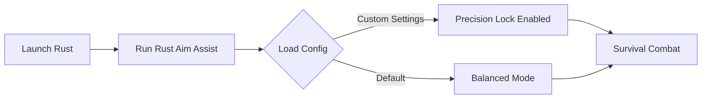

# Rust Aim Assist Software 🎯 for Precision Survival Combat

Survival in *Rust* is as much about awareness as it is about accuracy. Our **Rust Aim Assist software** is engineered for players who want tighter control, smoother targeting, and smarter combat engagements. Whether you're farming, raiding, or defending, this tool brings a noticeable edge without sacrificing flexibility.

---

## 🔎 Overview

Rust is unforgiving—every missed shot can cost you loot, bases, or hours of grind. The **Aim Assist module** integrates seamlessly with your gameplay, ensuring that even under pressure your crosshair stays locked and responsive. With custom sensitivity curves, hotkey toggles, and compatibility for multiple setups, it adapts to your unique style.

---

## ⚙️ Features

* **Precision Lock System** – Keep targets aligned during chaotic PvP battles.
* **Configurable Smoothness** – Adjust tracking fluidity for either aggressive snaps or subtle corrections.
* **Hotkey Toggles** – Activate or pause assist instantly with your preferred keybinds.
* **FOV Targeting Control** – Set your aim window from tight headshots to wide combat zones.
* **Lightweight Overlay** – Minimal performance impact; optimized for stable FPS.

[!IMPORTANT]
Every build is stress-tested to ensure no performance drops on mid-range PCs.

---

## 🖥 Compatibility

| Platform       | Status          | Notes            |
| -------------- | --------------- | ---------------- |
| Windows 10/11  | ✅ Supported     | Full build       |
| Linux (Proton) | ⚠️ Limited      | Requires tweaks  |
| Steam Deck     | ⚠️ Experimental | Reduced features |

[!NOTE]
Accessibility profiles are included for different mouse DPIs and controller setups.

---

## ⚡️ Setup Guide

1. Download the verified build package.
2. Extract into a secure folder.
3. Run the injector with administrator rights:

   ```bash
   RustAssist.exe --inject
   ```
4. Configure your sensitivity, FOV, and hotkeys in `config.json`:

   ```json
   {
     "smoothness": 0.45,
     "fov": 65,
     "toggle_key": "ALT"
   }
   ```
5. Launch Rust and test settings in a safe zone before raiding.

---

## 🌀 Workflow Diagram



---

## ❓ FAQ

**Q: Does Rust Aim Assist reduce FPS?**
A: No, it's lightweight and optimized to keep frames stable.

**Q: Can I switch configs quickly?**
A: Yes, multiple profiles can be hot-swapped mid-session.

**Q: Is it compatible with custom keybinds?**
A: Absolutely, you can re-map toggles to any unused key.

**Q: How often is the software updated?**
A: Builds are refreshed monthly to align with Rust patches.

**Q: Can I use it with a controller?**
A: Yes, experimental controller mapping is available.

---

## 🚀 Final Thoughts

In Rust, milliseconds matter. **Rust Aim Assist software** helps balance skill with survival efficiency by sharpening your aim mechanics. Perfect for players who demand consistency in every firefight.

[](#)
[](#)
[](#)
[](#)

---
